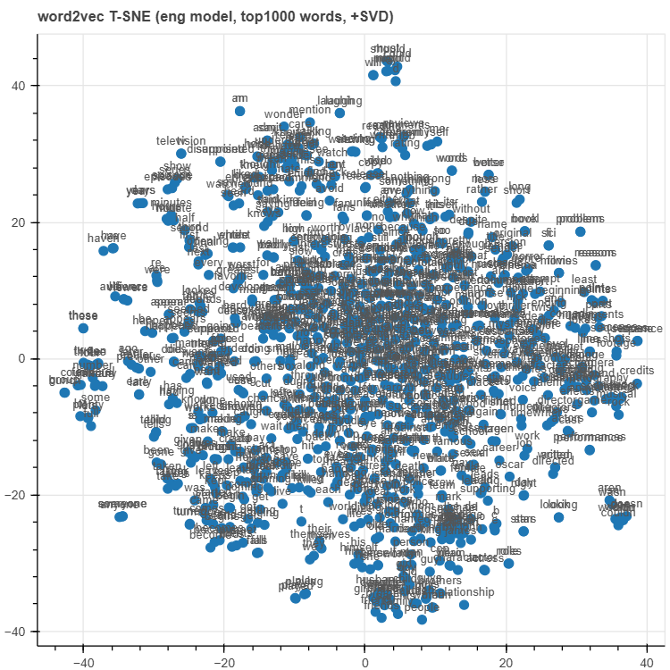
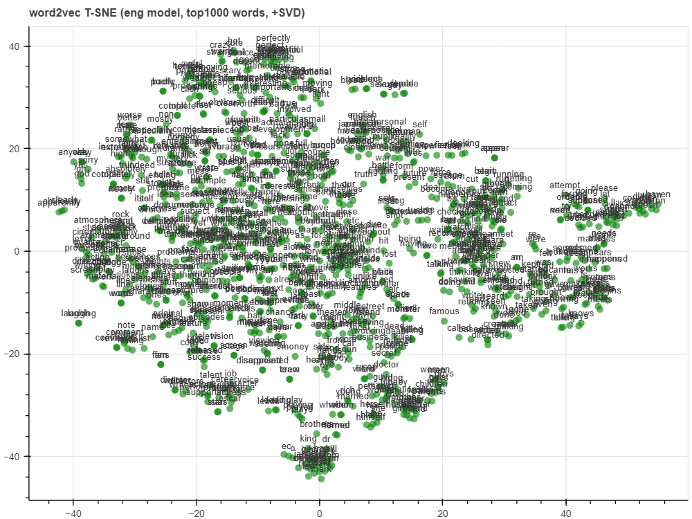

# Заключение по задаче 2: Конвертация тегов Mystem в UPOS для оценки Word2Vec

## Описание выполненной технической работы

Для корректной работы **модели эмбеддингов** (такой как Word2Vec) 
слова в оценочном наборе данных должны использовать ту же систему 
разметки, что и обученная модель. Если они не совпадают, модель не 
распознает слова и не сможет оценить свою точность.

### Что такое теги частей речи (POS)?
Теги частей речи (Part-of-Speech, POS) указывают на грамматическую 
категорию каждого слова (существительное, глагол, прилагательное и т.д.). 
Существуют различные системы тегирования:

- **Mystem**: Система, разработанная Яндексом для русского языка
- **UPOS**: Универсальная система тегов, используемая международно

### Почему это необходимо?
Предобученная модель Word2Vec, которую мы используем (180/model.bin), 
использует теги UPOS (например, `_NOUN`, `_VERB`), но наш файл с аналогиями 
(`ru_analogy_tagged.txt`) использует теги Mystem (например, `_S`). 
Для корректной оценки модели необходимо, чтобы обе использовали одну 
и ту же систему тегирования.

### Как это реализовано?
Мы автоматически конвертировали все теги Mystem в файле аналогий в их 
эквиваленты UPOS, используя таблицу преобразования.

## Результаты оценки

### С исходными тегами Mystem:
(0.0,
[{'section': 'capital-common-countries', 'correct': [], 'incorrect': []},
{'section': 'capital-world', 'correct': [], 'incorrect': []},
{'section': 'currency', 'correct': [], 'incorrect': []},
{'section': 'city-in-state', 'correct': [], 'incorrect': []},
{'section': 'family', 'correct': [], 'incorrect': []},
{'section': 'gram1-Aective-to-adverb', 'correct': [], 'incorrect': []},
{'section': 'gram2-opposite', 'correct': [], 'incorrect': []},
{'section': 'gram6-nationality-Aective', 'correct': [], 'incorrect': []},
{'section': 'Total accuracy', 'correct': [], 'incorrect': []}])

### После конвертации тегов Mystem в UPOS:

**Общая точность: 33.60%**

Модель Word2Vec правильно отвечает примерно на 1 из 3 аналогий.

**Распределение по категориям:**

| Категория | Результат | Оценка | Комментарий |
|-----------|-----------|---------|-------------|
| **capital-common-countries** | 0/12 (0.00%) | ❌ Плохо | Модель не понимает отношения страна-столица |
| **capital-world** | 0/32 (0.00%) | ❌ Плохо | Модель не понимает слова, связанные со столицами стран |
| **currency** | 5/132 (3.79%) | ❌ Плохо | Модель почти не распознает денежные отношения |
| **family** | 223/306 (72.88%) | ✅ Отлично | Модель очень хорошо понимает семейные отношения |
| **gram1-adjective-to-adverb** | 349/930 (37.53%) | ⚡ Удовлетворительно | Понимает некоторые грамматические преобразования (напр.: быстрый → быстро) |
| **gram2-opposite** | 191/702 (27.21%) | ⚡ Удовлетворительно | Некоторая способность находить противоположности (напр.: большой-маленький, высокий-низкий) |
| **gram6-nationality-adjective** | 21/234 (8.97%) | ❌ Плохо | Почти не распознает национальности (напр.: Франция-французский, Германия-немецкий) |

## Выводы

1. ✅ **Отлично** работает с семейными отношениями (72.88%)
2. ⚡ **Удовлетворительно** с грамматическими преобразованиями (37.53%)
3. ⚡ **Удовлетворительно** с нахождением противоположностей (27.21%)
4. ❌ **Плохо** с географией, экономикой и национальностями

**Причина результатов:** Обучающий корпус, вероятно, содержит много текстов, 
связанных с семейными отношениями, и мало специализированных текстов по 
географии и экономике. Поэтому результаты, связанные с географией (0%), 
экономикой (3.79%) и национальностями (8.97%), оказались очень низкими.

## Валидация

**Первые строки конвертированного файла:**
: capital-common-countries
афины_NOUN греция_NOUN багдад_NOUN ирак_NOUN
афины_NOUN греция_NOUN бангкок_NOUN таиланд_NOUN
афины_NOUN греция_NOUN пекин_NOUN китай_NOUN
афины_NOUN греция_NOUN берлин_NOUN германия_NOUN
афины_NOUN греция_NOUN берн_NOUN швейцария_NOUN

# 3 visualization  

# T-SNE de Word Embeddings

1. Точки представляют 1000 наиболее часто встречающихся слов. 

2. показывает несколько точек, разбросанных вправо и вверх
3. показывает высокую центральную плотность

# T-SNE de Word2Vec con SVD

1. показывает несколько четких и сгруппированных точек
2. плотность не сосредоточена в центре, а больше распределена по группам

# Conclusion for Task 2: Mystem to UPOS Tag Conversion for Word2Vec Evaluation

## Description of Technical Work Performed

For an **embedding model** (like Word2Vec) to function correctly, 
words in the evaluation dataset must use the same tagging system 
as the trained model. If they don't match, the model won't recognize 
the words and won't be able to evaluate its accuracy.

### What are Part-of-Speech (POS) Tags?
Part-of-Speech tags (POS) indicate the grammatical category of each word 
(noun, verb, adjective, etc.). There are different tagging systems:

- **Mystem**: System developed by Yandex for Russian language
- **UPOS**: Universal tagging system used internationally

### Why is it necessary?
The pre-trained Word2Vec model we are using (180/model.bin) uses UPOS tags 
(like `_NOUN`, `_VERB`), but our analogy file (`ru_analogy_tagged.txt`) 
uses Mystem tags (like `_S`). To correctly evaluate the model, both need 
to use the same tagging system.

### How was it implemented?
We automatically converted all Mystem tags in the analogy file to their 
UPOS equivalents using a conversion table.

## Evaluation Results

### With Original Mystem Tags:
(0.0,
[{'section': 'capital-common-countries', 'correct': [], 'incorrect': []},
{'section': 'capital-world', 'correct': [], 'incorrect': []},
{'section': 'currency', 'correct': [], 'incorrect': []},
{'section': 'city-in-state', 'correct': [], 'incorrect': []},])

### After Converting Mystem Tags to UPOS:

**Overall Accuracy: 33.60%**

The Word2Vec model correctly answers approximately 1 out of 3 analogies.

**Breakdown by Category:**

| Category | Result | Rating | Comment |
|----------|---------|---------|---------|
| **capital-common-countries** | 0/12 (0.00%) | ❌ Poor | Model doesn't understand country-capital relationships |
| **capital-world** | 0/32 (0.00%) | ❌ Poor | Model doesn't understand words related to country capitals |
| **currency** | 5/132 (3.79%) | ❌ Poor | Model hardly recognizes monetary relationships |
| **family** | 223/306 (72.88%) | ✅ Excellent | Model understands family relationships very well |
| **gram1-adjective-to-adverb** | 349/930 (37.53%) | ⚡ Satisfactory | Understands some grammatical transformations (e.g., fast → quickly) |
| **gram2-opposite** | 191/702 (27.21%) | ⚡ Satisfactory | Some ability to find opposites (e.g., big-small, tall-short) |
| **gram6-nationality-adjective** | 21/234 (8.97%) | ❌ Poor | Hardly recognizes nationalities (e.g., France-French, Germany-German) |

## Conclusions

1. ✅ **Excellent** with family relationships (72.88%)
2. ⚡ **Satisfactory** with grammatical transformations (37.53%)
3. ⚡ **Satisfactory** with finding opposites (27.21%)
4. ❌ **Poor** with geography, economics, and nationalities

**Reason for Results:** The training corpus likely contains many texts 
related to family relationships and few specialized texts on geography 
and economics. Therefore, results related to geography (0%), economics 
(3.79%), and nationalities (8.97%) were very low.

## Validation

**First lines of the converted file:**
: capital-common-countries
афины_NOUN греция_NOUN багдад_NOUN ирак_NOUN
афины_NOUN греция_NOUN бангкок_NOUN таиланд_NOUN
афины_NOUN греция_NOUN пекин_NOUN китай_NOUN
афины_NOUN греция_NOUN берлин_NOUN германия_NOUN

# visualization  

# T-SNE de Word Embeddings

1. The dots represent the 1000 most frequent words.
2. shows several dots scattered to the right and upward
3. shows a high central density

# T-SNE de Word2Vec con SVD

1. shows several distinct and grouped dots
2. The density is not concentrated in the center, but rather distributed among the groups

